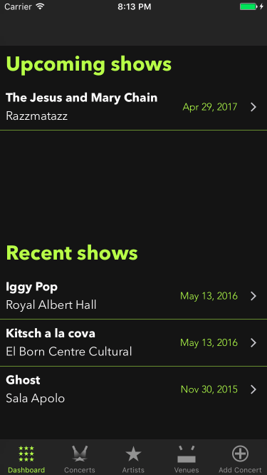
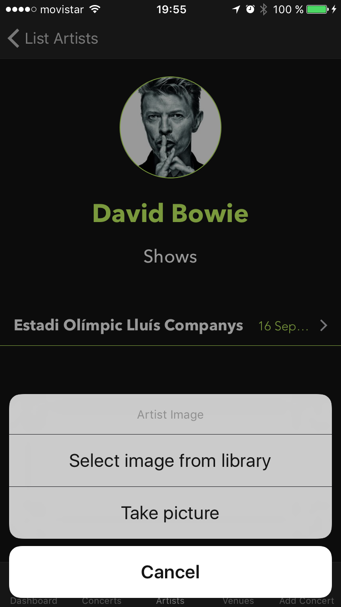
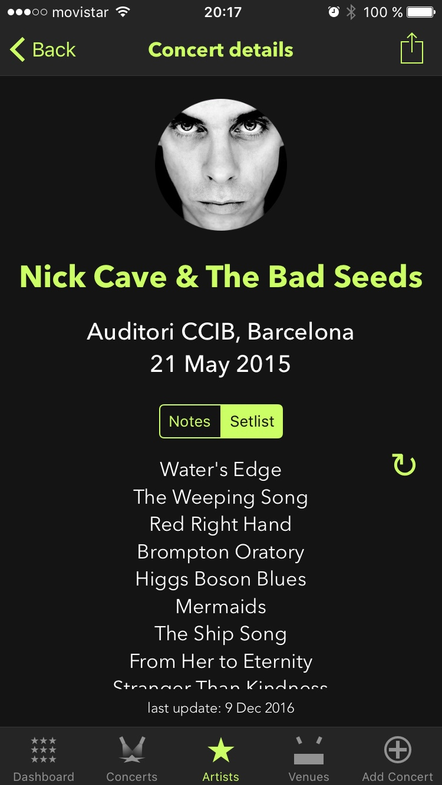
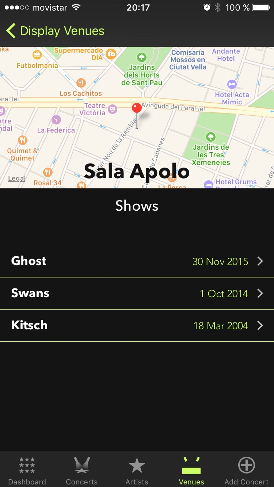
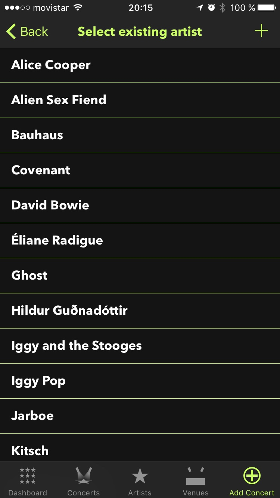
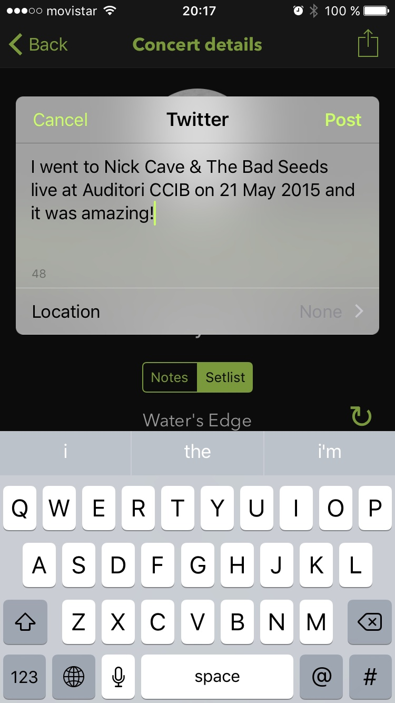

# Showtime

Showtime is an iOS app for tracking music shows that you attended or will attend.

## Screenshots

 &nbsp;&nbsp;
 &nbsp;&nbsp;
 &nbsp;&nbsp;
 &nbsp;&nbsp;
 &nbsp;&nbsp;
 &nbsp;&nbsp;

## Tech stack

The app was developed with Swift and Core Data for iOS devices and used setlist.fm as the API for the concerts setlist and the venues information.